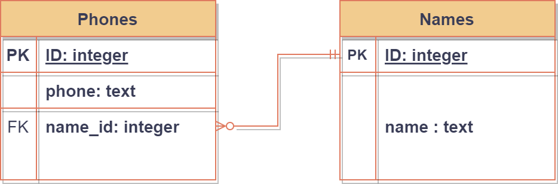
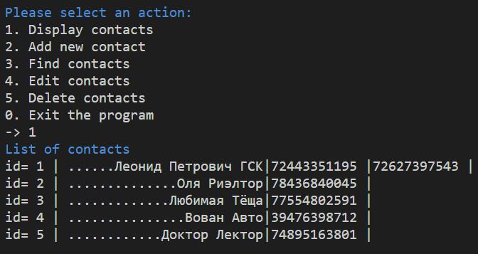

# Телефонный справочник

***Задача*** Создать телефонный справочник с внешним хранилищем информации, функционалом добавления информации, удаления и редактирования.

***Решение:*** В качестве хранилища данных была выбрана СУБД SQLite3 с двумя связными таблицами Names и Phones, содержащих соответственно имена (легко масштабируется для хранения фамилий, отчеств, дней рождений) и телефоны. К одному уникальному значению таблицы Names может быть привязано неограниченное кол-во телефонов.

### <code>[Дамп базы данных](https://github.com/ChistilinMV/PhoneBookPy/blob/main/phonebook_backup4.sql)</code>

**Рисунок 1 - Блок-схема структуры БД справочника**

Функционал программы позволяет выводить список контактов (См. Рис. 2), добавлять новые записи, производить поиск по телефону или фрагменту имени, редактировать имя и добавлять новые телефоны к уже существующему контакту, а также удалять контакт.

**Рисунок 2 - Пример вывода списка контактов**